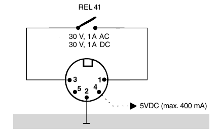
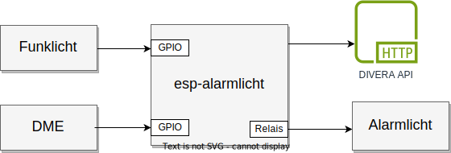

# ESP32 Alarmlicht

[[_TOC_]]

[ESPHome](https://esphome.io/) basierte, automatisierte Alarmauslösung über einen `http` request bei Alarmierung eines Melders in einer LGRA Ladestation.

Um automatisiert einen Alarm per `http` request (z.B. über [DIVERA 24/7](https://www.divera247.com)) auszulösen, wird der Relaiskontakt 
des Ladegeräts Swissphone LGRA Expert ausgewertet.

## Ladegerät Swissphone LGRA Expert

Das Ladegerät verfügt über einen fünfpoligen DIN-Stecker (female) mit folgender Belegung:



Pin `4` ist mit der Stromversorung des Netzteils verbunden (`+5V`), Pin `2` ist `GND`, Pins `1` und `3` werden potentialfrei durch ein Relais geschaltet.

### Relaiskonfiguration/Lötbrücke

Im Auslieferungszustand wird der Relaiskontakt geschlossen wenn der DME eine Meldung empfängt. Der Kontakt wird wieder geöffnet, wenn alle Meldungen quittiert wurden.

Über eine Lötbrücke wird das Verhalten des Relais konfiguriert. Wird diese Lötbrücke entfernt, so wird das Relais bei jedem Meldungseingang für ca. `10 s` 
geschlossen, unabhängig vom Quittieren vorheriger Meldungen.

Für die Verwendung des Ladegerätes mit dem `esp-alarmlicht` muss die Lötbrücke entfernt werden.

 


## Blockdiagramm



Das `esp-alarmlicht` wertet zwei `GPIO` Eingänge aus. `GPIO16` wird über ein Relais einer Funkfernbedienung angesteuert. Wird dieses Relais geschlossen, soll das über ein Relais das Alarmlicht angesteuert werden.
`GPIO18` wird über das Relais im Ladegerät des DME gesteuert. Wird das Relais geschlossen, soll das Alarmlicht angesteuert werden und ein `http` request zu Auslösung eines Alarms ausgelöst werden.


## Hardware

Basis des `esp-alarmlicht` ist ein [ESP32-EVB-EA-IND](https://www.olimex.com/Products/IoT/ESP32/ESP32-EVB) Board mit einem `ESP32-WROOM-32UE` Modul.

Die Statusanzeige erfolgt über drei LEDs.

### Bill Of Materials

* [ESP32-EVB-EA-IND](https://www.olimex.com/Products/IoT/ESP32/ESP32-EVB)
* [BOX-ESP32-EVB-EA](https://www.olimex.com/Products/IoT/ESP32/BOX-ESP32-EVB-EA)
* 3x LED
* Widerstände
  * 2x `220R`
  * 3x `3k`
  * 2x `10k`

## Software

### Setup

```
python -m venv .venv
source .venv/bin/activate
pip install -r requirements.txt
esphome wizard alarmlicht.yaml
esphome run alarmlicht.yaml
```

## Lizenz

  <p xmlns:cc="http://creativecommons.org/ns#" xmlns:dct="http://purl.org/dc/terms/"><a property="dct:title" rel="cc:attributionURL" href="https://github.com/momu/esp32-alarmlicht/">ESP32-Alarmlicht</a> is licensed under <a href="http://creativecommons.org/licenses/by-nc-sa/4.0/?ref=chooser-v1" target="_blank" rel="license noopener noreferrer" style="display:inline-block;">CC BY-NC-SA 4.0</a></p> 