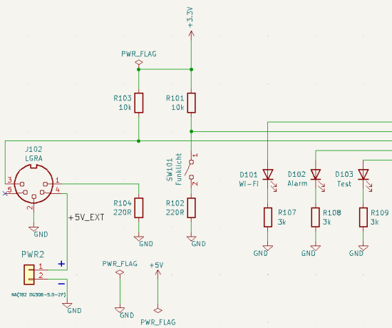

# ESP32 Alarmlicht


[ESPHome](https://esphome.io/) basierte, automatisierte Alarmauslösung über einen `http` request bei Alarmierung eines Melders in einer `LGRA` Ladestation.

Um automatisiert einen Alarm per `http` request (z.B. über [DIVERA 24/7](https://www.divera247.com)) auszulösen, wird der Relaiskontakt des Ladegeräts `Swissphone LGRA Expert` ausgewertet.


## Blockdiagramm


Das `esp32-alarmlicht` wertet zwei `GPIO` Eingänge aus. `GPIO16` wird über ein Relais einer Funkfernbedienung angesteuert. Wird dieses Relais geschlossen, soll über ein Relais das Alarmlicht angesteuert werden.
`GPIO18` wird über das Relais im Ladegerät des Melders (DME) gesteuert. Wird das Relais geschlossen, soll das Alarmlicht angesteuert werden und ein `http` request ausgelöst werden.

## Status LEDs

Das `esp32-alarmlicht` verfügt über drei Status LEDs:

1. Auslösung des DME oder der Funkfernbedienung
1. Drücken des Testknopfes `BUT1`
1. Wi-Fi Verbindung (kurzes Blinken alle `3 s`)

## Hardware

Basis des `esp32-alarmlicht` ist ein [ESP32-EVB-EA-IND](https://www.olimex.com/Products/IoT/ESP32/ESP32-EVB) Board mit einem `ESP32-WROOM-32UE` Modul.

Die Statusanzeige erfolgt über drei LEDs, die mit `3k` Widerständen versehen sind.

Die beiden potenzialfreien Kontakte des Ladegerätes und des Funklichtes sind mit einem Pull-up Widerstand versehen und werden bei der Auslösung auf `GND` gezogen.

Die Stromversorgung des `ESP32-EVB-EA-IND` erfolgt über die Pins `2` und `4` des LGRA. Diese sind mit den Pads des unbestückten Steckers `PWR2` des Olimex-Boards verbunden.

Für eine korrekte Funktion muss im [`LGRA` eine Lötbrücke entfernt](#ladegerät-swissphone-lgra-expert) werden.



Vollständiges Schematic als `KiCad` Projekt oder als [PDF](hardware/esp32-alarmlicht.pdf) in [hardware/](hardware/).

### Bill Of Materials

* [ESP32-EVB-EA-IND](https://www.olimex.com/Products/IoT/ESP32/ESP32-EVB)
* [BOX-ESP32-EVB-EA](https://www.olimex.com/Products/IoT/ESP32/BOX-ESP32-EVB-EA)
* 3x LED
* Widerstände
  * 2x `220R`
  * 3x `3k`
  * 2x `10k`
* DIN Stecker 5-polig male
* [Plakette »Technisch fragwürdig«](https://loet.bar/products/plakette-fragwuerdig-sticker)

## Software

Die Software basiert auf [ESPHome](https://esphome.io). Das Konfigurationsfile ist [alarmlicht.yaml](alarmlicht.yaml).
Je nach Konfiguration wird bei Alarm- oder Testauslösung ein API-Request an `DIVERA` und [ntfy](https://ntfy.sh/) gesendet. Das Verhalten wird über die Variablen `global_send_*` gesteuert. Eine Testauslösung erfolgt über `BUT1` des `ESP32-EVB-EA-IND`.

Das File `secrets.yaml` enthält folgende Angaben:

* Wi-Fi Konfigurations- und Zugangsdaten
* `ntfy` URL
* `DIVERA` API Key

Beispieldaten befinden sich in  [secrets-example.yaml](secrets-example.yaml). Diese Datei muss in `secrets.yaml` umbenannt werden und mit echten Daten gefüllt werden.

[alarmlicht.yaml](alarmlicht.yaml) bindet folgende Dateien ein:

* [on-but1-press.yaml](on-but1-press.yaml): `BUT1` wird betätigt
* [on-message-receive.yaml](on-message-receive.yaml): `GPI016` oder `GPIO18` werden auf `GND` gezogen
* [send-alerts.yaml](send-alerts.yaml): Auslösen von `http` requests durch das Einbinden von
  * [http-request-divera.yaml](http-request-divera.yaml): Auslösen eines `DIVERA` `http` requests
  * [http-request-ntfy.yaml](http-request-ntfy.yaml): Auslösen eines `ntfy` `http` requests

Wird ein Alarm ausgelöst während keine Wi-Fi Verbindung besteht, wird der Alarm gespeichert und anschließend bei bestehender Wi-Fi Verbindung ausgelöst. Das Speichern geschieht über die globale Variable `global_alert_pending`.

Da der `http` request nicht immer erfolgreich ist, wird der Statuscode ausgewertet. Ist er nicht `200` und `429` wird mehrmals versucht, den `http` request zu senden. Das Verhalten und die maximale Anzahl der Versuche wird über die globalen Variablen `global_divera_http_request_*` gesteuert.

### Setup

```bash
python -m venv .venv
source .venv/bin/activate
pip install -r requirements.txt
esphome wizard alarmlicht.yaml
esphome run alarmlicht.yaml
```

### Building, Running, Logs

> The `esphome run <CONFIG>` command is the most common command for ESPHome. It
>
> * Validates the configuration
> * Compiles a firmware
> * Uploads the firmware (over OTA or USB)
> * Starts the log view

```bash
esphome run alarmlicht.yaml
```

> The `esphome logs <CONFIG>` command validates the configuration and shows all logs.

```bash
esphome logs alarmlicht.yaml
```

## Ladegerät Swissphone LGRA Expert

Das Ladegerät verfügt über einen fünfpoligen DIN-Stecker (female) mit folgender Belegung:


Quelle: [Ladegerät (A)LGRA Expert (PDF)](assets/datenblatt-lgra-expert.pdf)

Pin `4` ist mit der Stromversorgung des Netzteils verbunden (`+5V`), Pin `2` ist `GND`, Pins `1` und `3` werden potentialfrei durch ein Relais geschaltet.

### Relaiskonfiguration/Lötbrücke

Im Auslieferungszustand wird der Relaiskontakt geschlossen wenn der DME eine Meldung empfängt. Der Kontakt wird wieder geöffnet, wenn alle Meldungen quittiert wurden.

Über eine Lötbrücke wird das Verhalten des Relais konfiguriert. Wird diese Lötbrücke entfernt, so wird das Relais bei jedem Meldungseingang für ca. `10 s` geschlossen, unabhängig vom Quittieren vorheriger Meldungen.

Für die Verwendung des Ladegerätes mit dem `esp32-alarmlicht` muss die Lötbrücke entfernt werden.


## Ressourcen

* https://esphome.io
* https://docs.ntfy.sh
* https://www.kicad.org
* https://api.divera247.com
* [DIVERA Web-Schnittstelle (API Dokumentation)](https://help.divera247.com/pages/viewpage.action?pageId=19563127)
* [Olimex ESP32-EVB](https://www.olimex.com/Products/IoT/ESP32/ESP32-EVB/open-source-hardware)
* https://github.com/OLIMEX/ESP32-EVB
* [ESP32-WROOM-32E & ESP32-WROOM-32UE Datasheet](https://www.espressif.com/en/content/esp32-wroom-32e-esp32-wroom-32ue-datahseet)
  
## Bugs, Questions And Contributions

Please use the [projects issue tracker](https://github.com/momu/esp32-alarmlicht/issues) or create a [GitHub pull request](https://github.com/momu/esp32-alarmlicht/pulls).

## Lizenz

<p xmlns:cc="http://creativecommons.org/ns#" xmlns:dct="http://purl.org/dc/terms/"><a property="dct:title" rel="cc:attributionURL" href="https://github.com/momu/esp32-alarmlicht/">ESP32-Alarmlicht</a> is licensed under <a href="http://creativecommons.org/licenses/by-nc-sa/4.0/?ref=chooser-v1" target="_blank" rel="license noopener noreferrer" style="display:inline-block;">CC BY-NC-SA 4.0</a></p> 